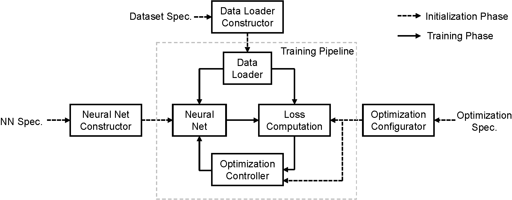
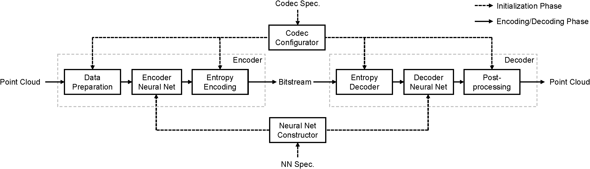

 # PccAI: A Framework for AI-based Point Cloud Compression

PccAI (*pick-kai*) is a PyTorch-based framework for conducting AI-based Point Cloud Compression (PCC) experiments. It is a modularized testbed for implementing AI-based PCC approaches, which supports the following tasks:
* Training/Testing deep neural networks for PCC.
* Benchmarking AI-based PCC approaches according to MPEG recommendation.
* Visualization of point clouds.

## Features

 * *Modularized design*: PccAI adopts a modularized design for training/inference, which makes it a highly flexible framework to verify AI-based PCC approaches.
 * *Plug-and-play pipelines*: PccAI provides the basic experiment pipelines for training, testing, and benchmarking. Users only need to focus on implementing necessary ingredients (*e.g.*, the neural network architecture) to test a proposed PCC method.
 * *Multi-modal data loading*: 3D point clouds have different representations, *e.g.*, 3D coordinates, voxel grids, octrees, and even images. PccAI supports multi-representation data loading so that a point cloud can be loaded in different ways.
 * *Heterogeneous batching*: an experimental mode for loading point clouds as octrees explicitly, where the leaf nodes with different numbers of points are organized as mini-batches for training/inference.

## Installation

We tested the PccAI framework under two different virtual environments with conda:
* Python 3.6, PyTorch 1.7.0, and CUDA 10.1. For this configuration, please launch the installation script `install_torch-1.7.0+cu-10.1.sh` with the following command:
```bash
echo y | conda create -n pccai python=3.6 && conda activate pccai && ./install_torch-1.7.0+cu-10.1.sh
```
* Python 3.8, PyTorch 1.8.1, and CUDA 11.1. For this configuration, please launch the installation script `install_torch-1.8.1+cu-11.2.sh` with the following command:
```bash
echo y | conda create -n pccai python=3.8 && conda activate pccai && ./install_torch-1.8.1+cu-11.2.sh
```
It is *highly recommended* to check the installation scripts which describe the details of the necessary packages. Note that [plyfile](https://github.com/dranjan/python-plyfile) is used for reading/writing PLY files, which is under GPL license. By replacing it with another library providing the same functionality, our implementation can still run.

After that, put the binary of `pc_error` (D1 & D2 computation tool used by the MPEG group) under the `third_party` folder if benchmarking with D1 and D2 metrics is desired. A publicly-available version of `pc_error` can be found [here](https://github.com/NJUVISION/PCGCv2/blob/master/pc_error_d). To use it with PccAI, please download and rename it to `pc_error`.

## Datasets
Create a `datasets` folder then put all the datasets below. One may create soft links to the existing datasets to save space.
### LiDAR Datasets

We support the loading of LiDAR datasets. To use the *Ford* sequences, please arranged it as follows:
```bash
${ROOT_OF_THE_REPO}/datasets/ford
                               ├── ford_01_q1mm
                               ├── ford_02_q1mm
                               └── ford_03_q1mm
                                       ├── Ford_03_vox1mm-0200.ply
                                       ├── Ford_03_vox1mm-0201.ply
                                       ├── Ford_03_vox1mm-0202.ply
                                       ...
                                       └── Ford_03_vox1mm-1699.ply
```
Other LiDAR datasets, such as *KITTI*, are arranged similarly. Refer to the data loaders in `pccai/dataloaders/lidar_base_loader.py` for more details.

### CAD Model Datasets

We support the loading of *ModelNet40* and *ShapeNet-Part* datasets. Our ModelNet40 data loader is built on top of the ModelNet40 mesh data loader of PyTorch Geometric. For the first run, it will automatically download ModelNet40 under the `datasets` folder and preprocess it. The ShapeNet-Part dataset can be downloaded [here](https://shapenet.cs.stanford.edu/ericyi/shapenetcore_partanno_segmentation_benchmark_v0.zip). After that, please arrange it as follows: 
```bash
${ROOT_OF_THE_REPO}/pccai/datasets/shapenet_part
                                       ├── shapenet_part_overallid_to_catid_partid.json
                                       └── shapenetcore_partanno_segmentation_benchmark_v0
                                               ├── 02691156
                                               ├── 02773838
                                               ...
                                               └── train_test_split
```

## Basic Usages

The core code of training, testing, and benchmarking code is below the `pccai/pipelines` folder. They are called by their wrappers below the `experiments` folder. The basic way to launch experiments with PccAI is:
 ```bash
 ./scripts/run.sh ./scripts/[filename].sh [launcher] [GPU ID(s)]
 ```
where `[launcher]` can be `s` (slurm), `d` (directly run in background) or `f` (directly run in foreground). `[GPU ID(s)]` should be ignored when launching with slurm. The results (checkpoints, point cloud files, log, *etc.*) will be generated under the `results/[filename]` folder. To understand the options for training/testing/benchmarking, refer to `pccai/utils/option_handler.py` for details.

### Working Examples

A recently published work, [GRASP-Net](https://github.com/InterDigitalInc/GRASP-Net), utilizes the PccAI framework to implement a high-performance AI-based codec for lossy point cloud compression. It can be a good working example for reference.

In the following, we also take a simple MLP-based PCC method for illustration. We will train it on the first Ford sequence and then test/benchmark it on the rest of the sequences.

We first apply octree partitioning to an input LiDAR point cloud where the octree will be encoded losslessly. Then the points in each partitioned block are encoded with a *PointNet*, leading to a group of codewords to be arithmetically encoded as a bitstream. On the decoder side, an MLP-based decoder is applied to decode each codeword, the decoded blocks are then assembled as a decoded point cloud.

### Trainging/Testing

 The following command is used to launch the training script:
 ```bash
./scripts/run.sh ./scripts/examples/train_ford_hetero.sh d 0,1
 ```
 which launches the training experiment directly on GPUs 0 & 1.

 Having trained the network, testing can be launched by the following command:
  ```bash
./scripts/run.sh ./scripts/examples/test_ford_hetero.sh d 0
 ```
Note that "testing" here means to check the loss values of the trained network on a specified dataset, but not to perform actual compression/decompression.

### Benchmarking

To run this particular benchmarking example, it is necessary to install [CompressAI](https://github.com/InterDigitalInc/CompressAI), refer to the installation script for more details. Please use the following command to benchmark the compression performance of the trained network, *e.g.*, compute *D1*, *D2*, and *bpp*:
  ```bash
./scripts/run.sh ./scripts/examples/bench_ford_hetero.sh d 0
 ```
The above command also generates a CSV file `mpeg_report.csv` holding the benchmarking results of one rate point. We provide a tool `utils/merge_csv.py` to merge several CSV files into one. The generated CSV file can be fed to [mpeg-pcc-ai-report](http://mpegx.int-evry.fr/software/MPEG/PCC/ai/mpeg-pcc-ai-report) or [AI-PCC-Reporting-Template](https://github.com/yydlmzyz/AI-PCC-Reporting-Template) to generate R-D curves and B-D statistics for reporting in the MPEG group.

### Visualization

A simple tool to visualize 3D point clouds is provided in `utils/visualize.py`, see `scripts/visualize.sh` for an example to use it. To use this tool, please also install the [Open3D](http://www.open3d.org/) library. Note that by pressing `h` at the visualization window, instructions provided by Open3D will be printed to the terminal.

## Software Architecture
Modern deep learning systems have three main ingredients for training: a deep neural network, a training data set, and an optimization method. Bearing this in mind, we developed three modules: a neural network constructor (`pccai/models`), a data loader constructor (`pccai/dataloaders`), and an optimization configurator (`pccai/optim`). These three modules take their associated configuration files in YAML format as inputs (see the examples under the `config` folder), then initialize the training pipeline. The diagram of training with PccAI is shown below:

<p align="center">
    
</p>

To perform actual encoding/decoding, one needs not only the trained neural network but also extra steps for pre-/post-processing and arithmetic encoding/decoding of the point clouds. In PccAI, an additional module, the codec configurator, is introduced to specify the behavior of the codec (`pccai/codecs`). It also takes as input a YAML file, please also check the examples under the `config`. The diagram of encoding/decoding with PccAI is shown below:

<p align="center">
    
</p>

## Implement Your AI-based PCC Method

Basic steps to implement your own AI-based PCC method are listed below:

 * Implement your neural network class under the `pccai/models/architectures` folder. For sub-modules needed in your network (*e.g.*, the PointNet in our example), please put them under `pccai/models/modules`. Your neural network class should contains a `.compress()` and a `.decompress()` functions, which perform actual compression/decompression operations with the trained network.

 * Implement your data loader in `pccai/dataloaders`, if our provided ones cannot satisfy your needs.

 * Implement your loss functions in `pccai/optim` by subclassing the `PccLossBase` class, if our provided ones cannot satisfy your needs.

 * Implement your codec class in `pccai/codecs` by subclassing the `PccCodecBase` class. It should include basic pre-/post- processing and functionalities to read/write bit-streams. It should has its own `.compress()` and `.decompress()` functions to respectively call `.compress()` and `.decompress()` of your network class.

 We *highly recommend* checking the aforementioned working examples for details of using the PccAI framework, where `pccai/models/architectures/mlpcomp.py` implements the example neural network architecture while `pccai/codecs/octree_partition_codec.py` implements the example codec.

## License
The PccAI framework is released under the BSD License, see `LICENSE` for details.

## Contacts
Please contact Jiahao Pang (jiahao.pang@interdigital.com), the main contributor of PccAI, if you have any questions.

## Acknowledgement
We thank Maurice Quach for providing valuable help, advice, and enlightenment during the development of the PccAI framework.

## Related Resources
 * [Guidelines for Conducting AI Exploration Experiments for PCC](https://www.mpeg.org/wp-content/uploads/mpeg_meetings/139_OnLine/w21694.zip), MPEG 3DG w21694, July 2022.
 * [PyTorch Geometric](https://pytorch-geometric.readthedocs.io)
 * [CompressAI](https://github.com/InterDigitalInc/CompressAI)
 * [GRASP-Net](https://github.com/InterDigitalInc/GRASP-Net)
 * [Open3D](http://www.open3d.org)
 * [mpeg-pcc-ai-report](http://mpegx.int-evry.fr/software/MPEG/PCC/ai/mpeg-pcc-ai-report) / [AI-PCC-Reporting-Template](https://github.com/yydlmzyz/AI-PCC-Reporting-Template)
 * [TMC13](https://github.com/MPEGGroup/mpeg-pcc-tmc13)
 * [TMC2](https://github.com/MPEGGroup/mpeg-pcc-tmc2)
 