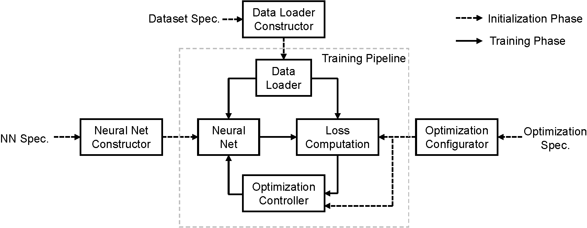
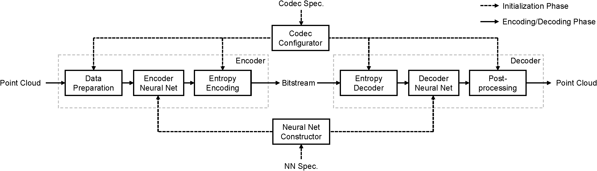

 # pccAI: A Framework for AI-based Point Cloud Compression

pccAI (*pick-kai*) is a PyTorch-based framework for conducting AI-based Point Cloud Compression (PCC) experiments. It is a modularized testbed for implementing AI-based PCC approaches, which supports the following tasks:
* Training/Testing of deep neural networks for PCC.
* Benchmarking AI-based PCC approaches.
* Visualization of point clouds.

## Features

 * Modularized design: pccAI adopts a modularized design for both the training and the inference phases, which makes it a highly flexible framework to verify AI-based PCC approaches.
 * Plug-and-play pipelines: pccAI provides the basic pipelines for training, testing, and benchmarking. Users only need to implement necessary ingredients (*e.g.*, the neural network) for running experiments.
 * Multi-modal data loading: 3D point clouds can be represented in different ways, *e.g.*, coordinates, voxel grids, octrees, and even images. The pccAI framework supports multi-representation data loading so that different types of point clouds can be loaded easily.
 * Heterogeneous batching: Different point clouds (or point cloud blocks) have a different number of points. Hence, it is not straightforward to form mini batches for training point-based neural networks. To address this problem, we developed a heterogeneous batching mode in pccAI.

## Installation

We tested pccAI on Python 3.6, PyTorch 1.7, and CUDA 10.1. Newer CUDA versions, CUDA 10.2 & 11.1, are also tested. It is recommended to install packages in a virtual environment, *e.g.*, using Conda.
 * Firstly, install the Python libraries in `requirements.txt`, which mainly includes low-level processing libraries such as NumPy, SciPy.
 * Install [Open3D](http://www.open3d.org/), [PyTorch Geometric](https://pytorch-geometric.readthedocs.io/en/latest/), and [CompressAI](https://github.com/InterDigitalInc/CompressAI). Please refer to their webpages for details. You may additionally install the [Minkowski Engine](https://github.com/NVIDIA/MinkowskiEngine) if you want to develop 3D sparse voxel-based approaches. 
 * We use the MPEG tool `pc_error` to benchmark point cloud geometry. Please put the compiled `pc_error_d` under the `third_party` folder. Another third-party function, `nndistance`, is used to compute Chamfer distance. It is modified based on the `nndistance` of [3D Point Capsule Networks](https://github.com/yongheng1991/3D-point-capsule-networks). In the `third_party/nndistance` folder, follow the example steps below for installation:
 ```bash
export PATH="/usr/local/cuda-10.1/bin:$PATH"
export LD_LIBRARY_PATH="/usr/local/cuda-10.1/lib64:$LD_LIBRARY_PATH"
python build.py install
python test.py
```

In `requirements.txt`, torchac, plyfile, and pygame are under the GPL or LGPL license. As a quick note, torchac is for arithmetic coding while plyfile and pygame will be used for point cloud I/O and visualization, respectively. By replacing them with libraries providing the same functions, the pccAI framework can still be used. Also torchac is used by the point cloud codec module, plyfile and pygame are called in the I/O and visualization modules.

## Datasets
Create a `datasets` folder then put all the datasets under it. You may create soft links to existing datasets for pccAI to access them.
### LiDAR Datasets

We support the loading of LiDAR datasets. For example, to use the *Ford* dataset, please arranged it as follows:
```bash
${ROOT_OF_THE_REPO}/pccai/datasets/ford
                                       ├── Ford_01_q_1mm
                                       ├── Ford_02_q_1mm
                                       └── Ford_03_q_1mm
                                               ├── Ford_03_vox1mm-0200.ply
                                               ├── Ford_03_vox1mm-0201.ply
                                               ├── Ford_03_vox1mm-0202.ply
                                               ...
                                               └── Ford_03_vox1mm-1699.ply
```
Other LiDAR datasets, such as *KITTI*, are arranged similarly. Refer to the data loaders in `pccai/dataloaders` for more details.

### CAD Model datasets

We support the loading of *ModelNet40* and *ShapeNet-Part* datasets. For ModelNet40, we build our data loader on top of the loader provided by Pytorch Geometric. It will download the ModelNet40 data under the `datasets` folder and preprocess it automatically. The ShapeNet-Part datasets can be downloaded [here](https://shapenet.cs.stanford.edu/ericyi/shapenetcore_partanno_segmentation_benchmark_v0.zip). After that, please arrange it as follows: 
```bash
${ROOT_OF_THE_REPO}/pccai/datasets/shapenet_part
                                       ├── shapenet_part_overallid_to_catid_partid.json
                                       └── shapenetcore_partanno_segmentation_benchmark_v0
                                               ├── 02691156
                                               ├── 02773838
                                               ...
                                               └── train_test_split
```

## Basic Usages

To begin with, we introduce the basics of using pccAI. The training, testing, and benchmarking pipelines are put under the `pccai/pipelines` folder. They are called by their corresponding entry points in the `experiments` folder. We have prepared a few example scripts under the `scripts` folder to launch these tasks.

In the following, we take an MLP-based PCC method for illustration. We will train it on a subset of the Ford data then test/benchmark it on the rest. In this method, we first apply octree partitioning to an input LiDAR point cloud. Then each partitioned block is encoded with a *PointNet*, leading to a group of codewords to be arithmetically encoded as a bitstream. On the decoder side, an MLP-based decoder is applied to decode each codeword, the decoded blocks are then assembled as a decoded point cloud.
### Trainging/Testing

 The options of the training experiment is listed in `scripts/hetero/train_ford_hetero.sh`, use the following command to launch it:
 ```bash
 ./scripts/run.sh ./scripts/hetero/train_ford_hetero.sh [launcher] [GPU ID(s)]
 ```
where `run.sh` is a simple script tool to launch jobs in a specified ways. Options of `launcher` include `d` (run directly), `s` (slurm), *etc*. For instance,
 ```bash
 ./scripts/run.sh ./scripts/hetero/train_ford_hetero.sh d 0,1
 ```
 would launch the training experiment directly on GPUs 0 & 1. Please modify `run.sh` according to your needs.

 Having trained the network, you may test it with the associated options in `scripts/hetero/test_ford_hetero.sh`. Similarly, testing can be launched by the following command:
  ```bash
 ./scripts/run.sh ./scripts/hetero/test_ford_hetero.sh [launcher] [GPU ID(s)]
 ```
Note by "testing", we meant to check the loss function of the trained network on a specified dataset.

### Benchmarking

To benchmark the compression performance of the trained network, *e.g.*, compute *D1*, *D2* and *bpp*, use the following command:
  ```bash
 ./scripts/run.sh ./scripts/hetero/bench_ford_hetero.sh [launcher] [GPU ID(s)]
 ```
where the benchmarking options are provided in `bench_ford_hetero.sh`.
 ### Additional Notes:

* To understand the meanings of the options for training/testing/benchmarking, refer to `pccai\utils\option_handler.py` for details.

* To achieve multi-GPU training, pccAI uses `DataParallel` by default. Additionally, it supports the `DistributedDataParallel` (DDP) mechanism. Simply set ``DDP="True"`` during training to enable it.

* The above examples use the heterogeneous batching mode, an experimental mode to deal with the different number of points in the octree-partitioned blocks. It can be disabled by letting `HETERO` be `False` in your design, which we called the homogeneous batching mode. Refer to the examples in `scripts/homo/` for details.

### Visualization

A simple tool to visualize 3D point clouds is provided in `utils/visualize.py`, which relies on Open3D for rendering. See `scripts/visualize.sh` for an example of using it. By pressing `h` at the visualization window, instructions provided by Open3D will be printed to the terminal.

## Software Architecture
Modern deep learning systems need three main ingredients for training: a deep neural network, a training data set, and an optimization method. Bearing this in mind, we developed three modules: a neural network constructor (`pccai/models`), a data loader constructor (`pccai/dataloaders`), and an optimization configurator (`pccai/optim`). These three modules take their associated configuration files in YAML format as inputs (see the examples under the `config` folder), then get prepared for the training pipeline. The diagram of training with pccAI is shown below:

<p align="center">
    
</p>

To perform actual encoding/decoding, we need not only the trained neural network but also extra steps for pre-/post-processing and arithmetic encoding/decoding of the point clouds. Hence, we introduce an additional module, the codec configurator, which specifies the behavior of the codec (`pccai/codecs`). It also takes as input a YAML file, please also check the examples under the `config`. The diagram of encoding/decoding with pccAI is shown below:

<p align="center">
    
</p>

## Add Your Custom Model

To create your own AI-based PCC method, some basic steps are needed:

 * Implement your neural network architecture and put it under the `pccai/models/architectures` folder. For sub-modules that are needed in your network (*e.g.*, the PointNet in our example), it is recommended to put them under `pccai/models/modules`.

 * Implement your data loader in `pccai/dataloaders`, if the provided ones cannot satisfy your needs.

 * Implement your loss functions in `pccai/optim` by subclassing the `PccLossBase` class, if the provided ones cannot satisfy your needs.

 * Implement your codec in `pccai/codecs` by subclassing the `PccCodecBase` class. It includes basic pre-/post- processing and also functionalities to write down bit-streams. Note that different neural network architectures may share the same codec if their pre-/post- processing steps are the same.

 * Implement a `.compress()` and a `.decompress()` functions in your neural network architecture, which converts an point cloud to/from strings. They are called by the `.compress()` and `.decompress()` functions in the codec.

 It is recommended to check the mentioned MLP-based PCC example and see how to implement new models. Specifically, `pccai/models/architectures/mlpcomp.py` implements the example architecture while `pccai/codecs/octree_partition_codec.py` implements the example codec.

## License
The pccAI framework is released under the BSD License, see `LICENSE` for details.

## Contacts
Please contact Jiahao Pang (jiahao.pang@interdigital.com), the main contributor of pccAI, if you have any questions.

## Acknowledgement
We thank Maurice Quach for providing valuable help, advice, and enlightenment during the development of the pccAI framework.

## Related Resources
 * Guidelines for Conducting AI Exloration Experiments for PCC, MPEG 3DG w21257, Feb. 2022.
 * TMC13: https://github.com/MPEGGroup/mpeg-pcc-tmc13
 * TMC2: https://github.com/MPEGGroup/mpeg-pcc-tmc2
 * Open3D: http://www.open3d.org
 * PyTorch Geometric: https://pytorch-geometric.readthedocs.io
 * CompressAI: https://github.com/InterDigitalInc/CompressAI
